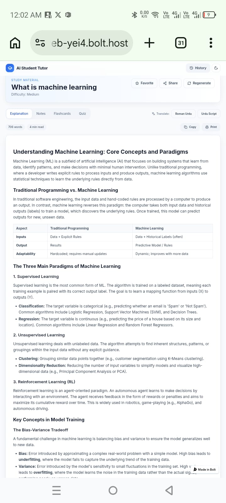
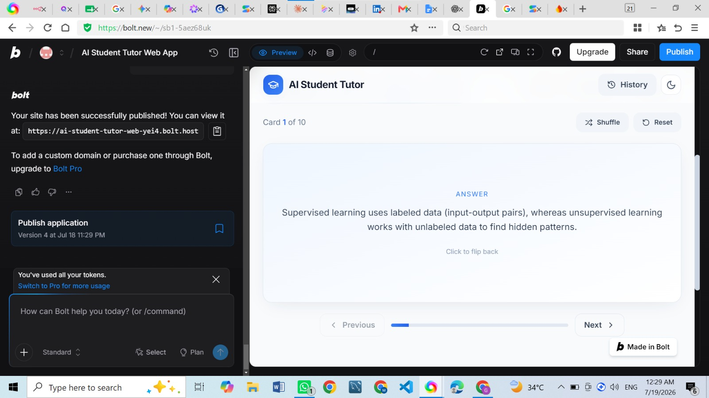

# AI Student Tutor

Understand any topic in seconds with AI. An AI-powered study assistant that generates explanations, notes, flashcards, and quizzes using Google Gemini.

## Features

- **AI Explanations** — Rich markdown with code blocks, tables, and lists.
- **Smart Notes** — 10 concise bullet points, copyable, exportable to PDF.
- **Interactive Flashcards** — 3D flip animation, shuffle, previous/next, progress bar.
- **Quizzes** — 5 MCQs with instant scoring, correct answers, and explanations.
- **Translation** — Convert active tab content to Roman Urdu or Urdu script.
- **PDF Export** — Professional notes PDF with title, topic, date, and footer.
- **Search History & Favorites** — Saved in LocalStorage.
- **Dark / Light Mode** — Animated toggle with system preference detection.
- **Responsive** — Mobile, tablet, and desktop layouts.

## Tech Stack

React 19, Vite, Tailwind CSS, Framer Motion, Lucide icons, React Router, React Markdown + remark-gfm, react-syntax-highlighter, `@google/generative-ai` SDK, jsPDF, Sonner.

## Installation

```bash
npm install
```

## Environment Variables

Create a `.env` file (see `.env.example`):

```
VITE_GEMINI_API_KEY=your_gemini_api_key_here
```

Get a key from Google AI Studio: https://aistudio.google.com/app/apikey

## Run

```bash
npm run dev
```

App runs on http://localhost:5173.

## Test the Gemini integration

```bash
npm run test:gemini
```

## Build

```bash
npm run build
npm run preview
```

## Deploy on Vercel

1. Push the repo to GitHub/GitLab/Bitbucket.
2. Import in Vercel. Framework preset: **Vite**.
3. Build command: `npm run build`. Output directory: `dist`.
4. Add `VITE_GEMINI_API_KEY` in Project Settings → Environment Variables.
5. Deploy.

## License

MIT

## Screenshots




